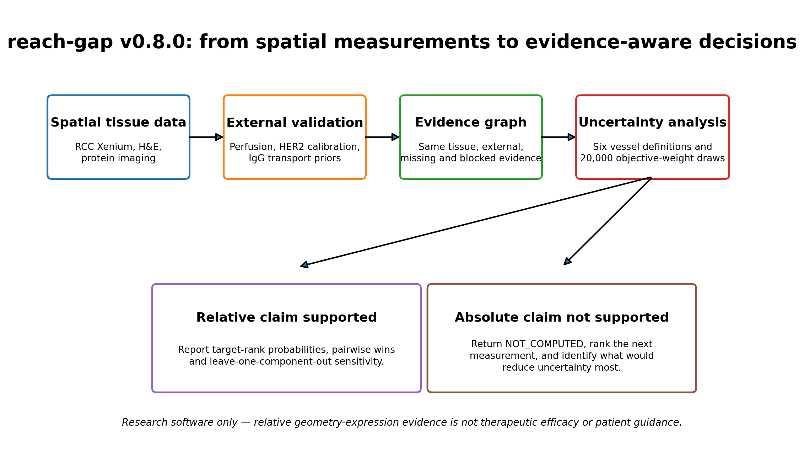
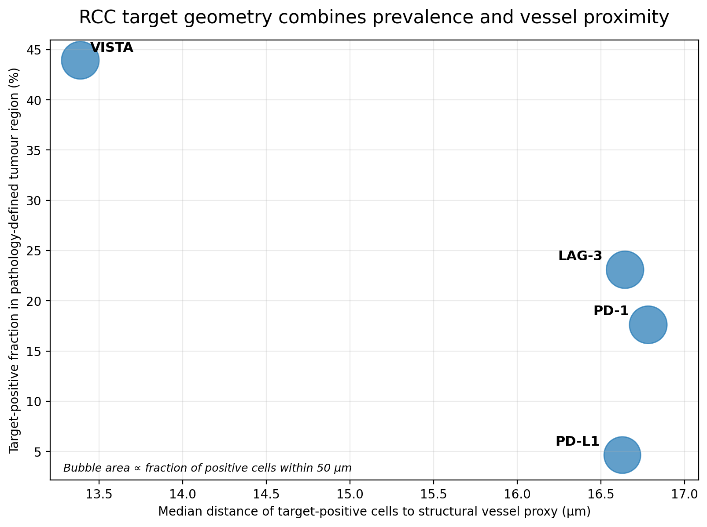
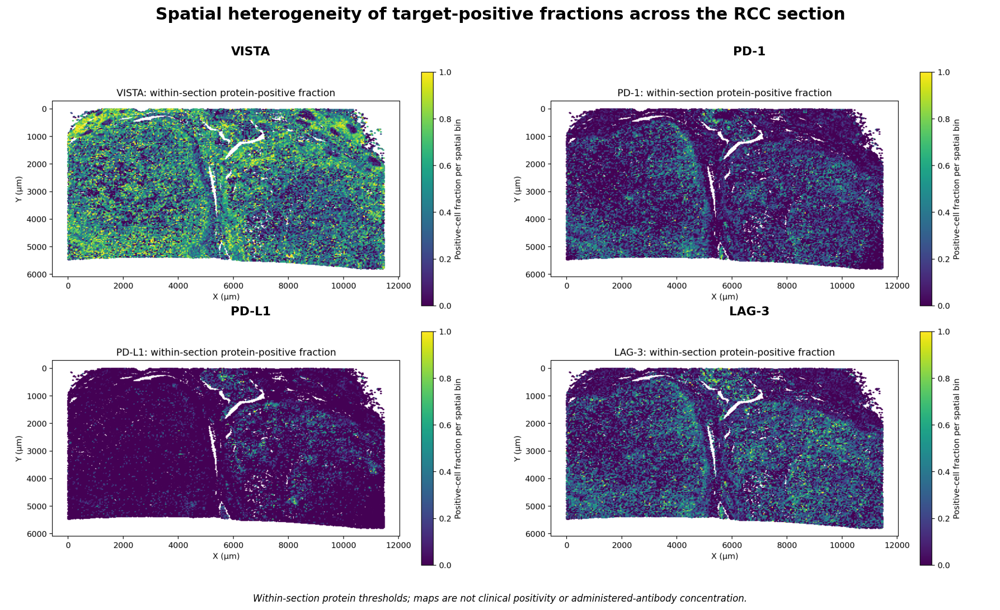
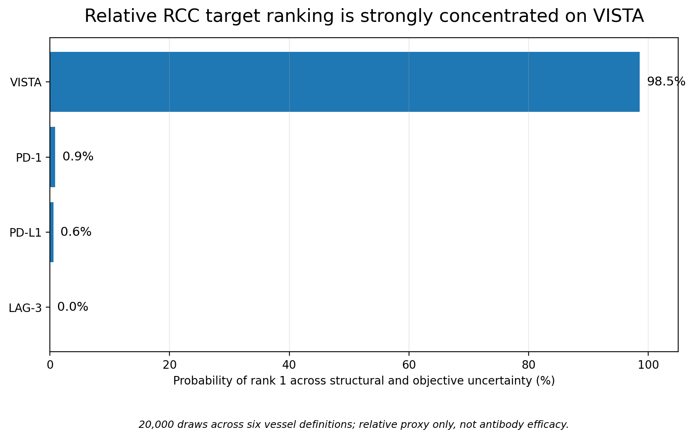
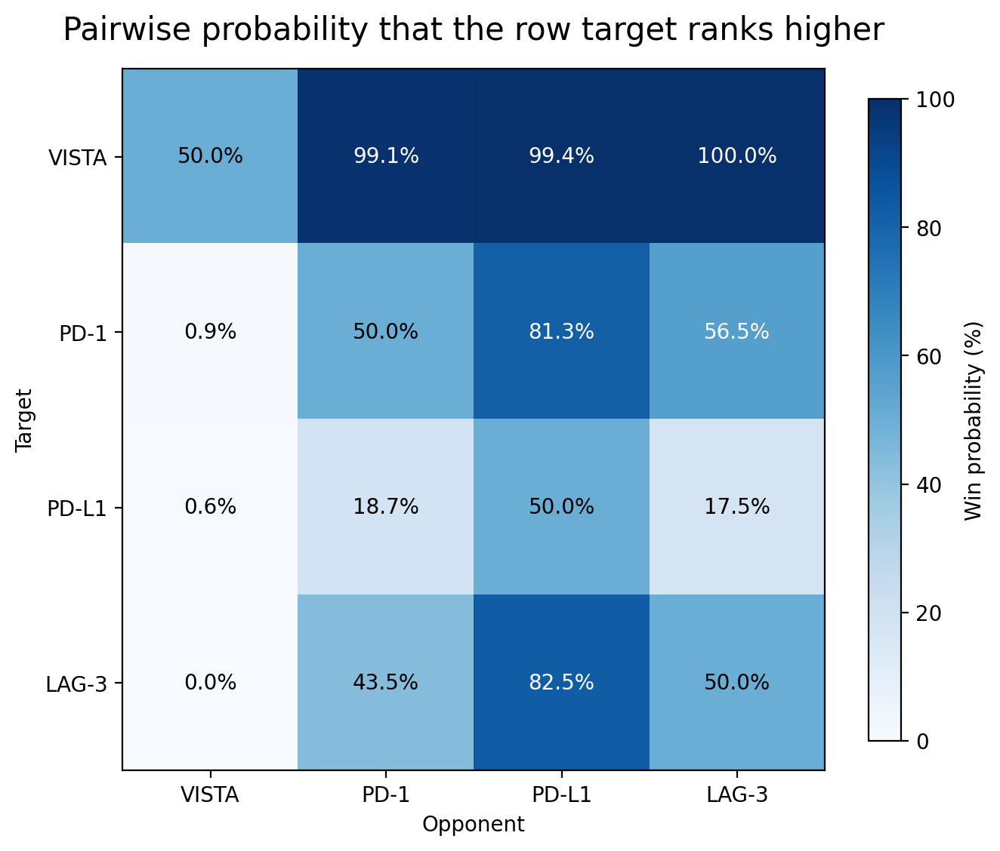
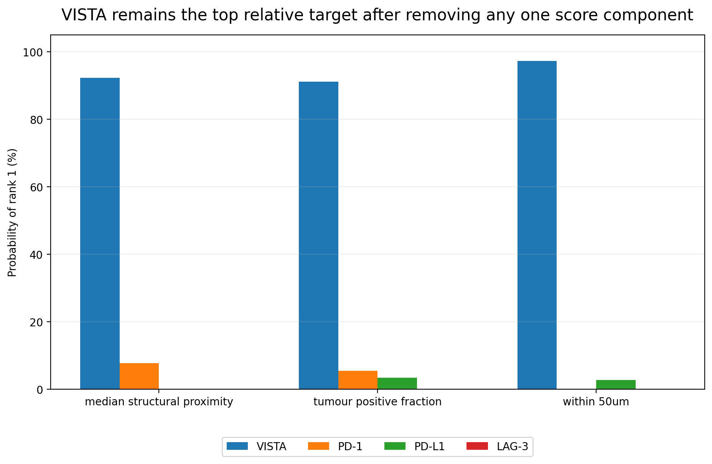
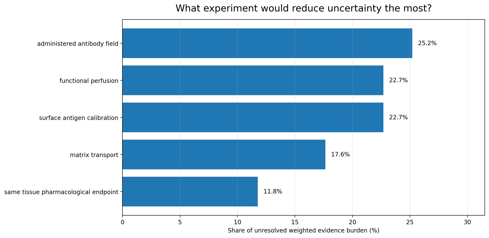
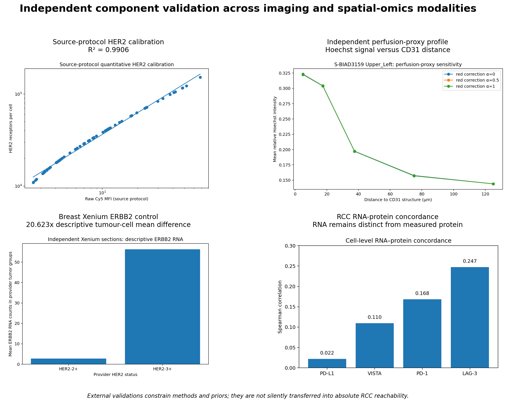
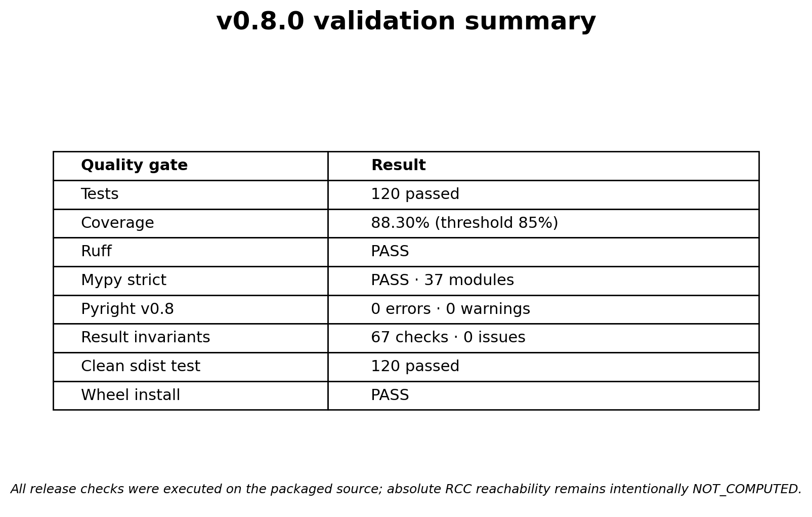

[](https://github.com/rsolerortuno/reach-gap/actions/workflows/ci.yml)
[](RELEASE_NOTES_v0.8.0.md)
[](results/build_validation_v0.8.json)
[](results/coverage_v0.8.json)
[](https://www.python.org/)
[](LICENSE)

# reach-gap

**An evidence-aware spatial modelling tool for asking whether target-positive tumour cells are physically accessible to an antibody — and for refusing to report an absolute answer when the required biology has not been measured.**

`reach-gap` connects spatial transcriptomics, protein imaging, tissue geometry and simplified reaction–diffusion modelling. It separates measurements made in the same tissue from external validations and literature priors, propagates uncertainty, compares targets on a transparent relative proxy, and records missing evidence as explicit `NOT_COMPUTED` outputs.

> **Research use only.** This project does not predict patient response, recommend treatment, or estimate clinical efficacy.

## The problem

A tumour target can be highly expressed and still be difficult for an antibody to reach. Accessibility depends on more than expression:

- which vessels are structurally present and functionally perfused;
- how far target-positive cells lie from those vessels;
- how quickly an antibody moves through the extracellular matrix;
- how strongly and how densely the antibody binds;
- whether an administered antibody actually reaches and engages the tissue.

These quantities are rarely measured together. A common failure mode is to silently combine RNA, fluorescence, literature diffusion values and vessel distance as if they were directly interchangeable. `reach-gap` was designed to make those transfers visible and to abstain when they are not defensible.

## The idea

The tool has two linked layers:

1. **Mechanistic layer** — represents vascular source geometry, diffusion, binding and internalisation in a simplified 2D reaction–diffusion model.
2. **Evidence layer** — records whether each required input is measured in the same tissue, externally validated, borrowed as a prior, missing, or blocked from transfer.

Version **0.8.0** adds an auditable evidence graph and a relative RCC target-ranking analysis across six defensible vessel definitions and 20,000 uncertainty draws.



## What the tool returns

Depending on the evidence available, `reach-gap` returns either:

- mechanistic simulation outputs with uncertainty;
- relative target-rank probabilities and pairwise comparisons;
- evidence-readiness and measurement-priority reports;
- or explicit abstentions such as `reachable_fraction = NOT_COMPUTED`.

The main scientific status of this release is:

```text
EVIDENCE_SYNTHESIS_AND_RELATIVE_RCC_TARGET_RANKING_COMPLETE_
ABSOLUTE_REACHABILITY_NOT_COMPUTED
```

## Headline results

### 1. Real RCC spatial analysis

The real renal-cell-carcinoma workflow contains **465,534 cells** with matched spatial geometry and protein measurements. Within pathology-defined tumour regions:

| Target | Target-positive cells | Positive fraction | Median distance to structural vessel proxy |
|---|---:|---:|---:|
| VISTA | 147,547 | **43.94%** | **13.39 µm** |
| LAG-3 | 77,540 | 23.09% | 16.64 µm |
| PD-1 | 59,132 | 17.61% | 16.78 µm |
| PD-L1 | 15,592 | 4.64% | 16.63 µm |

These are within-section thresholds and spatial measurements. They are not clinical positivity rates.



The complete section also shows strong spatial heterogeneity across targets:



### 2. Relative target robustness

Using same-section protein positivity and structural geometry only, VISTA ranked first in **98.525%** of 20,000 draws across six vessel definitions and uncertain objective weights.



Pairwise probabilities that the row target ranks above the column target are shown below.



VISTA remained first in more than 91% of draws after removing any one score component, showing that the ranking is not driven by a single term.



> This is a **relative geometry–expression proxy** in one RCC section. It is not proof of antibody penetration, therapeutic efficacy or clinical target priority.

### 3. Evidence readiness and the next experiment

Only **3 of 8** requirements for absolute RCC reachability are currently satisfied by same-tissue measurements. The fixed evidence-audit score is **40.5/100**. This is a completeness score, not a biological probability.

The largest unresolved evidence contributions are:

| Priority | Missing or external-only measurement | Share of unresolved burden |
|---:|---|---:|
| 1 | Administered-antibody concentration or target engagement | **25.21%** |
| 2 | Functional perfusion in the RCC section | **22.69%** |
| 3 | Surface-antigen calibration in molecules per cell | **22.69%** |
| 4 | RCC-specific matrix transport | **17.65%** |
| 5 | Same-tissue pharmacological endpoint | **11.76%** |



This turns missing data into an experimental plan: the next most informative measurement is a spatial administered-antibody or target-engagement field.

### 4. Independent component validation

The release also preserves independent validation layers rather than silently transferring them into RCC. The original v0.7 source-validation snapshot reported **-0.160** median distance–Hoechst Spearman, **2.38×** near/far enrichment, **50 tumours**, **65 uncensored replicate pairs**, **R² = 0.9906**, a broad IgG prior of **5.4–31.2 µm²/s**, and **679,197 unique cells** in the breast cohort audit. Version 0.7.1 then completed all four perfusion fields and native Xenium ERBB2 extraction.

- **Perfusion proxy:** four independent S-BIAD3159 fields; median distance–Hoechst Spearman **−0.2049** and median near/far enrichment **3.062×**.
- **HER2 calibration:** 50 tumours and 65 uncensored replicate pairs; source-protocol log–log **R² = 0.9906**. It is not transferred to Xenium without a shared calibrator.
- **Breast Xenium control:** ERBB2 RNA extracted from **679,197 cells**; provider-labelled tumour cells showed a descriptive **20.623×** mean difference between HER2-3+ and HER2-2+ sections.
- **IgG transport prior:** literature-supported broad sensitivity interval of **5.4–31.2 µm²/s**, used as a prior rather than an RCC measurement.
- **Negative-result audit:** representative Bordeau images did not reproduce the published direction (`p = 0.60`), so concordance remains `NOT_COMPUTED`.



Full evidence and caveats are documented in [`docs/EVIDENCE_SYNTHESIS_V080.md`](docs/EVIDENCE_SYNTHESIS_V080.md), [`docs/RELATIVE_ACCESSIBILITY_V080.md`](docs/RELATIVE_ACCESSIBILITY_V080.md) and [`reports/model_card.md`](reports/model_card.md).

## How the pipeline works

```text
RCC Xenium + H&E + protein imaging
                 |
        spatial target geometry
                 |
      six vessel definitions
                 |
  external validation and literature priors
                 |
       machine-readable evidence graph
                 |
 uncertainty propagation and falsification checks
                 |
 relative ranking OR explicit NOT_COMPUTED abstention
```

The key safeguards are:

1. **Same-tissue evidence is separated from external evidence.**
2. **RNA, protein intensity and receptor copies remain distinct quantities.**
3. **Structural vessels are not assumed to be functionally perfused.**
4. **Sensitivity to vessel definitions is reported, not hidden.**
5. **Negative results remain visible.**
6. **Absolute outputs are blocked until their required measurements exist.**

A simple explanation is available in [`docs/HOW_IT_WORKS.md`](docs/HOW_IT_WORKS.md).

## Quick start

### Install from source

```bash
git clone https://github.com/rsolerortuno/reach-gap.git
cd reach-gap
python -m venv .venv
source .venv/bin/activate          # Windows: .venv\Scripts\activate
python -m pip install --upgrade pip
python -m pip install -e ".[dev,xenium]"
```

### Inspect the CLI

```bash
reach --help
```

### Validate the bundled v0.8 results

```bash
reach validate-v080-results results/evidence_synthesis_v0.8
```

### Rebuild the compact evidence-synthesis package

```bash
reach build-v080-package \
  --repository-root . \
  --output-dir results/evidence_synthesis_v0.8 \
  --draws 20000 \
  --seed 17
```

### Run the quick mechanistic benchmark

```bash
reach benchmark --quick --output /tmp/reach_gap_benchmark.json
```

## Data used

| Evidence layer | Main contribution | Included in repository? |
|---|---|---|
| RCC Xenium gene and protein data | Cell-level target localisation and structural geometry | Compact derived outputs only |
| RCC H&E and morphology-focus imaging | Pathology regions and image-based vessel/stroma checks | Compact QC figures and summaries |
| S-BIAD3159 microscopy | Independent Hoechst–CD31 perfusion-proxy validation | Derived summaries and figures |
| Quantitative HER2 workbook | Assay-specific intensity-to-receptor calibration | Derived calibration outputs |
| Published tumour FRAP studies | IgG transport sensitivity prior | Curated prior only |
| Bordeau trastuzumab supplement | Administered-antibody reference and negative-result audit | Compact derived benchmark |
| Breast Xenium HER2 sections | Independent ERBB2 RNA extraction control | Compact summaries only |

Large raw datasets are not redistributed. Their original terms and citation requirements still apply. See [`docs/DATA_FOR_NON_EXPERTS.md`](docs/DATA_FOR_NON_EXPERTS.md) and [`docs/DATA.md`](docs/DATA.md).

## Tests and reproducibility

The release was validated from the packaged source, including a clean extraction of the source distribution.

| Quality gate | Result |
|---|---:|
| Pytest | **120 passed, 0 failed** |
| Coverage | **88.30%**, threshold 85% |
| Ruff | **PASS** |
| Ruff format | **PASS** |
| Strict Mypy | **PASS across 37 modules** |
| Pyright on v0.8 modules | **0 errors, 0 warnings** |
| Full-package Pyright | **0 errors, 1 optional `pyarrow` source warning** |
| Result-bundle invariants | **67 checks, 0 issues** |
| Clean wheel installation | **PASS** |
| Clean sdist test | **120 passed** |



GitHub Actions repeats the suite on Python 3.11, 3.12 and 3.13. A separate scientific-validation job checks the frozen result invariants and quick mechanistic benchmark. The release workflow reruns all quality gates, regenerates all nine portfolio figures, verifies that the Git tag matches the package version, builds both distributions and smoke-tests the wheel before publishing any asset.

Run the main checks locally:

```bash
make ci
python scripts/generate_portfolio_figures.py --output-dir /tmp/reach-gap-figures
python -m build
```

The GitHub-specific audit validates README sections and links, workflow YAML, figure presence, version consistency and the bundled release evidence. Publication instructions are in [`docs/GITHUB_RELEASE.md`](docs/GITHUB_RELEASE.md).

Machine-readable validation is stored in [`results/build_validation_v0.8.json`](results/build_validation_v0.8.json), [`results/static_analysis_v0.8.json`](results/static_analysis_v0.8.json), [`results/coverage_v0.8.json`](results/coverage_v0.8.json) and [`results/github_publication_validation_v0.8.json`](results/github_publication_validation_v0.8.json).

## Repository map

```text
src/reach_gap/                 production Python package
results/                       compact scientific outputs and validation artefacts
reports/figures/               portfolio-ready summary figures
reports/metrics/               selected machine-readable v0.8 metrics
reports/model_card.md          intended use, evidence and failure modes
docs/                          methods, assumptions, data and detailed results
examples/                      small example inputs and outputs
scripts/                       reproducible utilities and figure generation
tests/                         offline unit and integration tests
notebooks/                     data-preparation notebook
.github/workflows/             CI and automated tagged-release workflows
GitHub Releases                 wheel, source distribution, checksums and validation assets
```

## Explicitly uncomputed claims

- **model concordance**: `NOT_COMPUTED`
- Real clinical retrospective: `NOT_COMPUTED`
- `reachable_fraction`: `NOT_COMPUTED`
- `penetration_depth`: `NOT_COMPUTED`
- `expression_reach_gap`: `NOT_COMPUTED`

These are deliberate scientific abstentions, not missing software outputs.

## Limitations

- The real RCC analysis is currently based on one deeply characterised section, not a clinical cohort.
- Structural vessel proximity does not establish functional perfusion.
- Protein fluorescence is not calibrated to surface molecules per cell.
- Literature diffusion priors are not measurements of the RCC matrix.
- The relative target score is sensitive to its stated objective and should not be interpreted as efficacy.
- Absolute `reachable_fraction`, `penetration_depth`, `expression_reach_gap` and pharmacological concordance remain `NOT_COMPUTED`.
- A simplified 2D model cannot reproduce whole-body pharmacokinetics or full 3D transport.

The full limitation register is in [`docs/LIMITATIONS.md`](docs/LIMITATIONS.md).

## Future plans

The next scientifically meaningful steps are:

1. co-register an administered antibody or target-engagement field with the RCC tissue;
2. measure functional perfusion in the same section;
3. add a shared quantitative surface-antigen calibrator;
4. estimate RCC-specific IgG transport or a validated surrogate;
5. evaluate a blinded same-tissue pharmacological endpoint;
6. repeat the workflow across independent RCC sections and tumour types;
7. extend the 2D solver toward 3D tissue geometry and whole-tumour uncertainty.

## Conclusion

`reach-gap` demonstrates that spatial target expression is only one part of antibody accessibility. In the current RCC section, VISTA combines high target prevalence with favourable structural proximity and is robustly first under the declared relative objective. The more important result, however, is what the software does **not** claim: absolute antibody reachability remains unidentified without same-tissue perfusion, receptor calibration, administered-drug measurements and a pharmacological endpoint.

The project is designed to make that boundary auditable, reproducible and useful for planning the next experiment.

## Citation and license

See [`CITATION.cff`](CITATION.cff) for citation metadata. Source code is released under the [MIT License](LICENSE). External datasets remain subject to their original terms.
